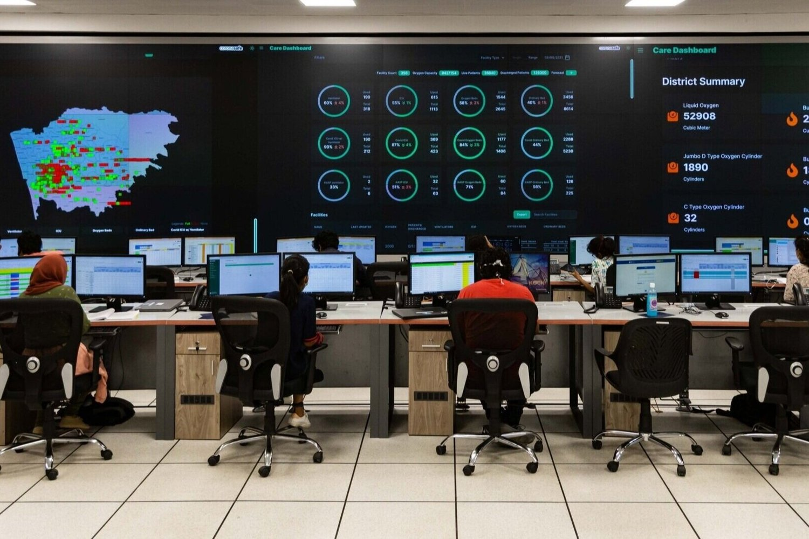

# Author
Suyash Singh

# Contact Info
- [Email](mailto:suyashsingh.stem@gmail.com)
- [Linked In](https://www.linkedin.com/in/suyashsingh-stem/)
- [GitHub](https://www.github.com/geekgawd/)

# Project Description

CARE is a centralized platform for managing healthcare resources and patients. It is an open-source software which aims to bring us one step closer to the digitalization of healthcare in India.

As part of the Code4GovTech program, this project aims at enhancing the front-end performance of CARE
by implementing efficient data serializers. This will result in retrieving only the data required for the front
then, thus reducing the load on the database and leading to better performance.

The project CARE currently heavily uses `ModelSerializer` from the Django Rest Framework. `ModelSerializer` offers a convenient way to create a Serializer class by automatically generating fields from Django Model's Class.

However, this leads to the problem that the existing serializers send more data is sent to the frontend than is needed to just List out the data, which just needs a simplified representation of the objects.

This also leads to unnecessary SQL joins in the backend for the representation of nested data. This is very bad news for performance and cost.

So, my purpose for the project is following:

## Create Separate List and Detail Serializers for CARE Backend Modules

- **List Serializer:** Create a new serializer specifically for handling the list view of the model. This list serializer should only include the necessary fields required for the list view. Remove any fields that are not needed in the list view to minimize unnecessary data retrieval.

- **Detail Serializer:** Create another serializer for handling the detail view of the model. This detail serializer should include all the fields necessary for displaying detailed information about a single instance of the model. It can inherit from the list serializer and add any additional fields that are specific to the detail view.

## Add and Improve Testing

Though this is not part of my proposal. CARE currently lacks unit tests and the test coverage for all modules. If time allows I will work on improving the test coverage for the backend.
