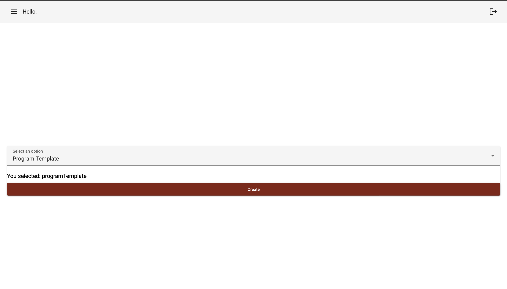

## Milestones
- [x] Create Program Template using Dynamic forms
- [x] Logout 
- [x] Implemented guards in routing in Angular
- [x] Frontend Validation
- [x] Homepage with App bar
- [x] Login and Sign Up UI Corrections

## Screenshots / Videos 

- **Homepage with App Bar**

- **Login Page** *(Angular)* 

## Contributions

- **Pull Request**
    - [PR#3](https://github.com/ELEVATE-Project/template-creation-portal/pull/3)

## Midpoint Demo
- ### Midpoint Presentation Link
  - [Template Creation Portal [Midpoint Demo presentation]](https://docs.google.com/presentation/d/1o9bto7NcWyAaQQwDw9KQjZV1fV2YOLFkE6pkldSDy-I/edit?usp=sharing)

- ### Feedback

Reviewer comments were positive and suggested a new feature to add SSO(Single Sign On) feature to make the portal available to different kind of customers, by detaching user services.

## Learnings

- **Dynamic form**

Dynamic forms in Angular refer to forms that are generated dynamically at runtime based on the data or configuration provided. This approach allows developers to create flexible and reusable form components that can adapt to different data structures and requirements.

- **Guards in Angular**

In Angular, guards are used to control the navigation to and from certain routes. They allow you to implement logic that decides whether a route should be activated (navigated to) or deactivated (navigated from) based on certain conditions. Guards are essential for adding security, authorization, authentication, and other custom checks to your application's routes.
